# Gestion-financiere - Graphes


## Objectifs

- Manipuler des graphes et des sous-graphes orientés.
- Utiliser des structures de données d'une bibliothèque normalisée (les [conteneurs de la Bibliothèque standard de C++](https://en.cppreference.com/w/cpp/container)).
- Implémenter un algorithme de parcours d'un graphe.
- Appliquer les graphes à une problématique.

## Problématique

Dans ce travail, on s'intéresse à un système financier où plusieurs institutions sont liées entre elles par des prêts et/ou des dettes. 
On va notamment chercher les dettes ou les prêts circulaires qui peuvent être réduits. 
Pour ce faire, on modélise un système financier avec un graphe orienté, en suivant les étapes de construction suivantes,
- Chaque institution sera représentée par un sommet dans le graphe.
- Si une institution `u` a prêté une somme d'argent `X` à une institution `v`, alors on ajoutera un arc `(u,v)` avec le poids `X` au graphe.
  - La somme `X` doit être strictement positive.
  - Un arc `(u,v)` peut être vu comme une *dette* pour `v` et un *prêt* pour `u`.

On utilise une liste d'adjacence pour représenter un tel graphe. 
Donc, chacun sommet sera associé à un de sommets et de poids représentant les arcs sortants et leurs poids.
Ce qui donne, par exemple, un fichier texte comme celui-ci,
```
ATB (BIC,1700) (BNP,3050) (CIC,7622) 
AXA (BNP,9200) 
BEA (ATB,2100) (AXA,1100) (BOC,3900) (ING,9390) 
BIC (BMO,3012) (BNP,3220) 
BMO (AXA,3440) (BOA,2410) (NBG,3240) 
BNC (BEA,4500) (NBG,4710) 
BNP (BEA,5000) (BMO,4000) 
BNS (BIC,5320) (BOA,6370) (CIC,2313) 
BOA (NBG,7400) (RBC,5100) 
BOC (AXA,2200) (NBG,1740) 
CIC (ING,4200) (LCL,5500) 
ING (ATB,1700) (BNC,1302) 
LCL (BNS,8010) (BOA,3900) (RBC,4420) 
NBG (AXA,1500) (LCL,5320) 
RBC (NBG,3800)
```
Pour représenter le graphe suivant,


### Dette circulaire

Dans un tel graphe on peut trouver des **dettes circulaires** comme par exemple,
```
l'institution BNP qui a prêté à BEA
    l'institution BEA qui a prêté à ATB
        l'institution ATB qui a prêté à BIC
            l'institution BIC qui a prêté à BMO
                l'institution BMO qui a prêté à AXA
                    l'institution AXA qui a prêté à BNP
```
On part donc de l'institution `BNP` et on revient à cette même institution. 
Par conséquent, il est possible de réduire l'ensemble de ces dettes circulaires en les réduisant toutes en fonction de la plus basse. 
On peut donc représenter cette dette circulaire de l'institution `BNP` par le graphe suivant,

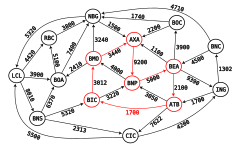

Et on pourra réduire toutes ces dettes cirulaires de `1700` (la plus petite dette dans le circuit décrit plus haut), ce qui donnera,

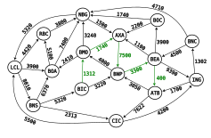

Évidemment, comme la dette entre l'institution `ATB` et `BIC` tombe à `0` l'arc `(ATB,BIC)` sera supprimé.

>**Remarque.** Dans ce qui suit, on considère que des chemins (et par extention les circuits) simples et élémentaires. 
C'est-à-dire qu'un chemin ne passe pas deux fois par le même sommet ou le même arc.

### Réduction

On va donc s'intéresser à implémenter cette réduction pour une institution donnée autant de fois que c'est possible (jusqu'à ce que ça ne soit plus possible). 
En résumé, pour une institution donnée,
- Il faut trouver toutes les dettes circulaires qui partent d'une institution donnée, donc un circuit de dettes dans le graphe qui commence à l'institution donnée en paramètre.
- Diminuer toutes les dettes du circuit par la plus petite dette, un arc sera donc supprimé à la fin.
- On refait la même chose autant de fois que possible.
  - On procédera par ordre alphabétique si plusieurs institutions sont accessibles en même temps.

<p>

<details>

<summary>Exemple de réduction complète pour l'institution <code>BNP</code></summary>
<b> 1 - Circuit de dettes : </b><code>BNP -&gt; BEA -&gt; ATB -&gt; BIC -&gt; BMO -&gt; AXA -&gt; BNP</code>.
<br>

<br>
La dette minimale <code>1700</code> est entre <code>ATB -&gt; BIC</code>, donc cet arc sera supprimé et les autres dettes du circuit seront réduite de <code>1700</code>.
<br>

<br>
<b> 2 - Circuit de dettes : </b><code>BNP -&gt; BEA -&gt; ATB -&gt; BNP</code>.
<br>
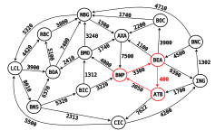
<br>
La dette minimale <code>400</code> est entre <code>BEA -&gt; ATB</code>, donc cet arc sera supprimé et les autres dettes du circuit seront réduite de <code>400</code>.
<br>
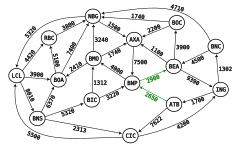
<br>
<b> 3 - Circuit de dettes : </b><code>BNP -&gt; BEA -&gt; AXA -&gt; BNP</code>.
<br>
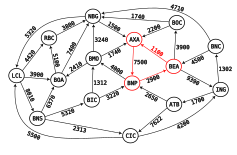
<br>
La dette minimale <code>1100</code> est entre <code>BEA -&gt; AXA</code>, donc cet arc sera supprimé et les autres dettes du circuit seront réduite de <code>1100</code>.
<br>
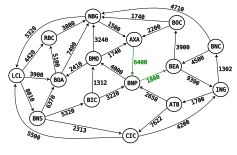
<br>
<b> 4 - Circuit de dettes : </b><code>BNP -&gt; BEA -&gt; BOC -&gt; AXA -&gt; BNP</code>.
<br>
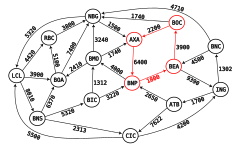
<br>
La dette minimale <code>1800</code> est entre <code>BNP -&gt; BEA</code>, donc cet arc sera supprimé et les autres dettes du circuit seront réduite de <code>1800</code>.
<br>
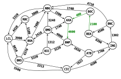
<br>
<b> 5 - Circuit de dettes : </b><code>BNP -&gt; BMO -&gt; AXA -&gt; BNP</code>.
<br>
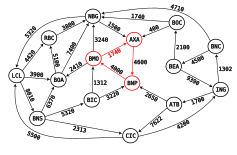
<br>
La dette minimale <code>1740</code> est entre <code>BMO -&gt; AXA</code>, donc cet arc sera supprimé et les autres dettes du circuit seront réduite de <code>1740</code>.
<br>
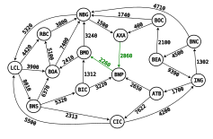
<br>
<b> 6 - Circuit de dettes : </b><code>BNP -&gt; BMO -&gt; BOA -&gt; NBG -&gt; AXA -&gt; BNP</code>.
<br>
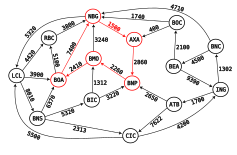
<br>
La dette minimale <code>1500</code> est entre <code>NBG -&gt; AXA</code>, donc cet arc sera supprimé et les autres dettes du circuit seront réduite de <code>1500</code>.
<br>
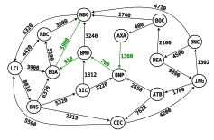
<br>
<b> 7 - Circuit de dettes : </b><code>BNP -&gt; BMO -&gt; BOA -&gt; NBG -&gt; LCL -&gt; BNS -&gt; BIC -&gt; BNP</code>.
<br>
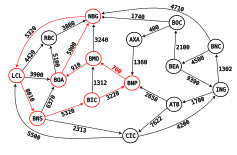
<br>
La dette minimale <code>760</code> est entre <code>BNP -&gt; BMO</code>, donc cet arc sera supprimé et les autres dettes du circuit seront réduite de <code>760</code>.
<br>
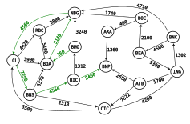
<br>
Au final, on obtient le graphe suivant avec aucune dette circulaire pour l'institution <code>BNP</code>
<br>

<br>
</details>

</p>

### Réduction de groupe

Plusieurs institutions peuvent s'entendre pour former une coopérative et se partager les dettes entre elles. 
Une réduction de groupe va faire la même chose qu'une réduction pour une institution, à l'exception qu'on ne cherche par forcément un circuit, mais plutôt un chemin qui part de n'importe quelle institution de la coopérative et se termine dès qu'une institution de la coopérative a été atteinte (pas nécessairement la même institution de départ). 
Une fois qu'un tel chemin est trouvé, on réduit les dettes qui y figurent de la même manière que la réduction précédente, en plus d'un traitement particulier si l'institution de départ du chemin n'est pas la même que l'institution d'arrivée. 
Dans ce cas, on devra mettre à jour l'arc entre ces deux institutions s'il existe, ou en créé un nouveau.
On suivra donc les étapes suivantes pour une réduction de groupe ou de coopérative,
- Il faut trouver tous les chemins qui partent de n'importe quelle institution de la coopérative et qui reviennent vers n'importe quelle institution de la coopérative.
  - Attention ces chemins doivent quitter la coopérative dès le départ, la réduction ne traite pas les chemins internes à la coopérative. Donc au départ, il faut absulument qu'on sort de la coopérative et dès qu'on y retourne on s'arrête.
- Diminuer toutes les dettes du chemin par la plus petite dette min, un arc sera donc supprimé à la fin.
- Si on suppose que l'institution de départ est `u` et l'institution d'arrivée est `v`, on aura le traitement suivant qui suivra l'étape précédente,
  - Si `u = v` rien ne sera fait (on a affaire à un circuit et la diminution est identique à la précédente).
  - Si non, on vérifie les cas suivants,
    - si un arc `(u,v)` existe, alors son poids sera augmenté de min.
    - si non, si un arc `(v,u)` existe, alors son poids sera diminué de min.
    - si aucun arc n'existe entre `u` et `v`, alors un nouvel arc `(u,v)` sera créé avec le poids min.
- On refait la même chose autant de fois que possible.
  - On procédera par ordre alphabétique si plusieurs institutions sont accessibles en même temps.

<p>

<details>

<summary><b>Exemple de réduction complète pour la coopération d'institutions <code>ATB,AXA,BEA,BIC,BMO,BNP</code></b></summary>
<b> La coopérative.</b> Une coopérative est un sous-graphe particulier qu'on appelle un <i>sous-graphe induit</i> par un certain ensemble de sommets <code>S</code>, un tel sous-graphe sera constitué des sommets de <code>S</code> et de tous les arcs du graphe qui ont les deux extrémités dans <code>S</code>.
Dans notre exemple <code>S = {ATB,AXA,BEA,BIC,BMO,BNP}</code> et le sous-graphe induit par <code>S</code> est le suivant,
<ul>
	<li><b>Sommets</b> : <code>{ATB,AXA,BEA,BIC,BMO,BNP}</code></li>
	<li><b>Arcs</b> : <code>{(ATB,BIC), (ATB,BNP), (AXA,BNP), (BEA,ATB), (BEA,AXA), (BIC,BMO), (BIC,BNP), (BMO,AXA), (BNP,BEA), (BNP,BMO)}</code></li>
</ul>
Qu'on peut représenter par le graphe suivant,
<br>
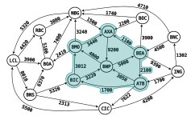
<br>
Pour la réduction on va donc considérer tout chemin qui part de <code>S</code> (la zone en bleu) et qui y revient.<br>
<b> 1 - Chemin de dettes : </b><code>ATB -&gt; CIC -&gt; ING -&gt; ATB</code> c'est un circuit, on aura donc un traitement identique à la réduction précédente.
<br>
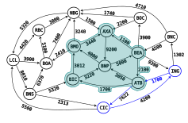
<br>
La dette minimale <code>1700</code> est entre <code>ING -&gt; ATB</code>, donc cet arc sera supprimé et les autres dettes du chemin seront réduite de <code>1700</code>.
<br>
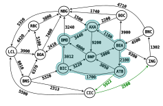
<br>
<b> 2 - Chemin de dettes : </b><code>ATB -&gt; CIC -&gt; ING -&gt; BNC -&gt; BEA</code>.
<br>
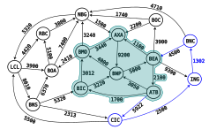
<br>
La dette minimale <code>1302</code> est entre <code>ING -&gt; BNC</code>, donc cet arc sera supprimé et les autres dettes du chemin seront réduite de <code>1302</code>.
<br>Comme un arc <code>(BEA,ATB)</code> existe (de l'institution d'arrivée vers celle de départ du chemin) le poids de cet arc sera diminué de <code>1302</code>. 
<br>
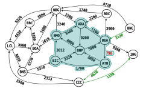
<br>
<b> 3 - Chemin de dettes : </b><code>ATB -&gt; CIC -&gt; LCL -&gt; BNS -&gt; BIC</code>.
<br>
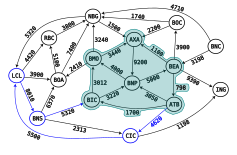
<br>
La dette minimale <code>4620</code> est entre <code>ATB -&gt; CIC</code>, donc cet arc sera supprimé et les autres dettes du chemin seront réduite de <code>4620</code>.
<br>Comme un arc <code>(ATB,BIC)</code> existe (de l'institution de départ vers celle d'arrivée du chemin) le poids de cet arc sera augmenté de <code>4620</code>. 
<br>
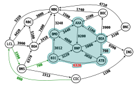
<br>
<b> 4 - Chemin de dettes : </b><code>BEA -&gt; BOC -&gt; AXA</code>.
<br>
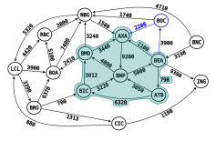
<br>
La dette minimale <code>2200</code> est entre <code>BOC -&gt; AXA</code>, donc cet arc sera supprimé et les autres dettes du chemin seront réduite de <code>2200</code>.
<br>Comme un arc <code>(BEA,AXA)</code> existe (de l'institution de départ vers celle d'arrivée du chemin) le poids de cet arc sera augmenté de <code>2200</code>. 
<br>
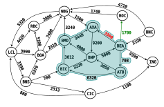
<br>
<b> 5 - Chemin de dettes : </b><code>BEA -&gt; BOC -&gt; NBG -&gt; AXA</code>.
<br>
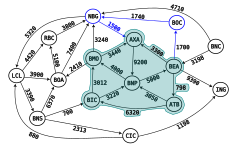
<br>
La dette minimale <code>1500</code> est entre <code>NBG -&gt; AXA</code>, donc cet arc sera supprimé et les autres dettes du chemin seront réduite de <code>1500</code>.
<br>Comme un arc <code>(BEA,AXA)</code> existe (de l'institution de départ vers celle d'arrivée du chemin) le poids de cet arc sera augmenté de <code>1500</code>. 
<br>
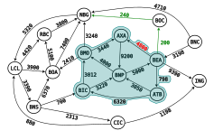
<br>
<b> 6 - Chemin de dettes : </b><code>BEA -&gt; BOC -&gt; NBG -&gt; LCL -&gt; BNS -&gt; BIC</code>.
<br>
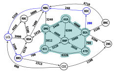
<br>
La dette minimale <code>200</code> est entre <code>BOC -&gt; BOC</code>, donc cet arc sera supprimé et les autres dettes du chemin seront réduite de <code>200</code>.
<br>Comme aucun arc n'existent entre <code>BEA</code> et <code>BIC</code>, l'arc <code>(BEA,BIC)</code> sera créé avec le poids <code>200</code>. 
<br>
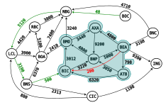
<br>
<b> 7 - Chemin de dettes : </b><code>BMO -&gt; BOA -&gt; NBG -&gt; LCL -&gt; BNS -&gt; BIC</code>.
<br>
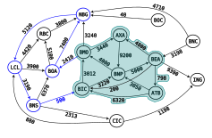
<br>
La dette minimale <code>500</code> est entre <code>BNS -&gt; BIC</code>, donc cet arc sera supprimé et les autres dettes du chemin seront réduite de <code>500</code>.
<br>Comme un arc <code>(BIC,BMO)</code> existe (de l'institution d'arrivée vers celle de départ du chemin) le poids de cet arc sera diminué de <code>500</code>. 
<br>
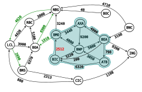
<br>
Pour au final arriver au graphe suivant où il n'existe aucun chemin partant de la coopérative formée par les institutions de <code>S</code> et revenant vers elle.
<br>
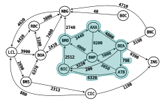
<br>
</details>

</p>

